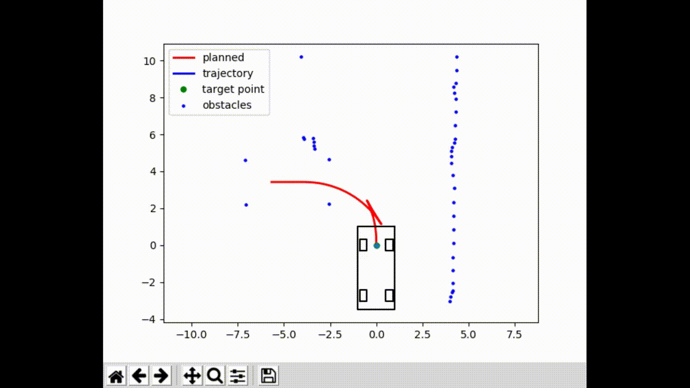
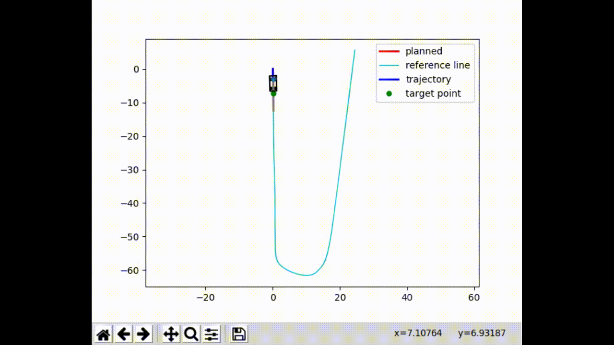
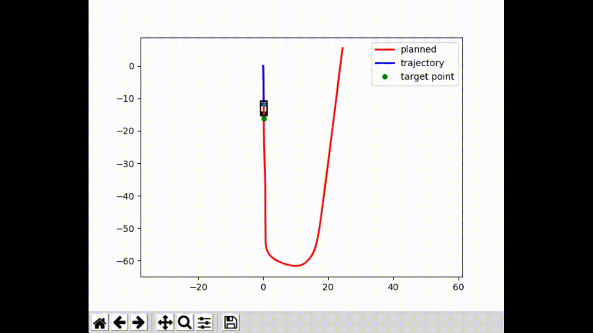

# Introduction

Based on Apollo platform, this repository simulates Planning, and Controlling on Parking and Cruising (on a reference line) scenarios, communicating with `ROS Melodic`. 

# Visualisation

## Parking



## Cruising

### Lattice Planning



### QP Planning



# Prerequisite

- glog
    
    ```bash
    cd ~ 
    mkdir Source
    cd Source
    git clone https://github.com/google/glog.git
    sudo apt-get install autoconf automake libtool
    cd glog
    mkdir build
    cmake ..
    make
    sudo make install
    ```
           
- protobuf

    ```bash
    cd ~/Source
    sudo apt-get install autoconf automake libtool curl make g++ unzip
    wget  https://github.com/protocolbuffers/protobuf/releases/download/v3.7.1/protobuf-cpp-3.7.1.tar.gz
    tar -xzvf protobuf-cpp-3.7.1.tar.gz
    cd protobuf-3.7.1
    ./autogen.sh
    ./configure
    make
    make check
    sudo make install
    sudo ldconfig
    ```

- osqp

    ```bash
    cd Source
    git clone --recursive https://github.com/oxfordcontrol/osqp
    cd osqp
    mkdir build && cd build
    cmake -G "Unix Makefiles" ..
    cmake --build .
    sudo make install
    ```

- unsupported
  
  move `Eigen/unsupported` to the include directory of `c++`.

- numpy
  
    ```bash
    pip install numpy
    ```

- matplotlib
  
    ```bash
    pip install matplotlib
    ```

# Nodes

There are four ROS nodes in total: `chassis_node`, `pc_node`, `obstacles_service` and `display`. 

- Chassis Node

    Simulates a chassis, receives control commands, updates vehicle pose before publishing to the PC node.

- PC Node
  
    The main node. Subscribes the chassis node, calls obstacles infomation on parking scenario, plans trajectories according to scenarios and computes commands before publishing them chassis node.

- Obstacles Service
  
  Simulates obstacles for parking scenario. Obstacles are saved in `Components/common/config/slot.json` instead of being detected synchronously as long as the vehicle moves.

- Display

    Synchronously visualises planned and simulated trajectories.

# Quick Start

- Make sure to install all the dependencies. 
- Update all the paths in `Components/common/config/log_path_conf.h` and `Components/scripts/obstacles_service.py`
- Prepare a recorded trajectory to be the reference line. Each column should be `time_stamp`, `type`(this position **Must** be maintained), `x`, `y`, `z`, `qw`, `qx`, `qy` and `qz`. The file **Must** be named as `path_*.txt`(`path_01.txt` in the example).
- Compile via `catkin_make`.
- run `dependencies.bash` **first**.
- run `launch.bash` to choose scenarios.(Please note that if `file name` is required, just input the suffix, for example "01".)

# Difference from Apollo

- Controllers
    - change the way to calculate target points
    - add termination of controllers
    - combine lateral and longitudinal controllers
    - add a pure persuit controller
    - add a feedforward controller
  
- Planning
    - add B-spline smoother

# Cons

- no consideration of re-planning
- no obstacles for lattice planner
- lateral controlling oscillation in LQR controller (possibly caused by latency)
